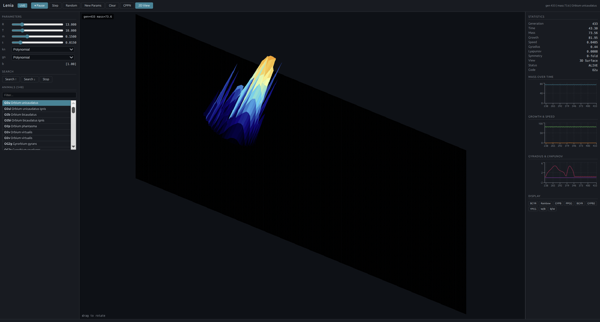

# Lenia.c



A complete C++ port of [Chakazul/Lenia](https://github.com/Chakazul/Lenia) — the continuous cellular automaton framework by Bert Chan.

## Features

- **Full simulation engine** — FFT-based convolution with 4 kernel types and 3 growth functions
- **FFTW acceleration** — auto-detects libfftw3 at runtime via dlopen (2-4x speedup)
- **N-dimensional support** — 2D and 3D simulation with n-dimensional FFT and kernel computation
- **563 creatures** — loads the full animals.json library from the original Lenia repo
- **Web dashboard** — React + WebSocket UI with live parameter controls, analysis charts, and 3D surface view
- **X11 GUI** — native Linux desktop app with keyboard controls
- **Analysis tools** — mass, growth, gyradius, speed, Lyapunov exponent, rotational symmetry detection
- **CPPN generator** — neural pattern-producing network for creating initial configurations
- **Search/breeding** — automated parameter search for stable organisms
- **Recording** — frame export and ffmpeg video/GIF recording
- **Benchmark suite** — Python vs C++ comparison across board sizes

## Architecture

```
include/
  lenia_board.h          NDArray, RLE codec, Board, Params
  lenia_automaton.h      Automaton, FFTND, kernel/growth functions
  lenia_analyzer.h       Statistics, symmetry analysis
  lenia_recorder.h       Video recording via ffmpeg
  lenia_cppn.h           Neural pattern generator
  lenia_app.h            Application (library, search, rendering)
src/
  lenia_board.cpp        ~450 lines
  lenia_automaton.cpp    ~350 lines
  lenia_analyzer.cpp     ~300 lines
  lenia_recorder.cpp     ~150 lines
  lenia_cppn.cpp         ~120 lines
  lenia_app.cpp          ~450 lines
  main.cpp               CLI entry point
  lenia_gui_x11.cpp      X11 interactive GUI
  lenia_server_mode.cpp  JSON streaming for web UI
ui/
  api/server.mjs         Node.js WebSocket bridge
  src/App.jsx            React dashboard
```

## Build

```bash
cmake -S . -B build -DCMAKE_BUILD_TYPE=Release
cmake --build build -j$(nproc)
```

Produces three executables:
- `build/lenia` — headless CLI
- `build/lenia_gui` — X11 interactive window
- `build/lenia_server` — JSON streaming server for web UI

## Run

### CLI
```bash
# Random world with Orbium parameters
./build/lenia --steps 1000 --size 256

# Load a creature from the library
./build/lenia --animals path/to/animals.json --code O2u --steps 500 --size 256
```

### X11 GUI
```bash
./build/lenia_gui --animals path/to/animals.json --size 128 --pixel 4
```
Controls: Space=pause, R=random, N=new params, +/-=next/prev creature, Q=quit

### Web Dashboard
```bash
cd ui && npm install && npx vite build
export SIM_SIZE=128 SIM_FPS=20
node api/server.mjs
# Open http://localhost:3100
```

Features:
- Live simulation with parameter sliders (R, T, m, s, kernel, growth)
- 2D pixel view with zoom (scroll wheel)
- 3D surface view with rotation (drag) — like the original Lenia JS
- Real-time charts: mass, growth, speed, gyradius, Lyapunov
- Filterable animal library (548 creatures)
- Search/breeding controls

## Performance

Benchmarked against the Python original (NumPy FFT) on Orbium unicaudatus:

| Size | C++ steps/s | Python steps/s | Speedup |
|------|------------|----------------|---------|
| 64×64 | 21,048 | 4,583 | **4.3×** |
| 128×128 | 5,490 | 2,463 | **2.3×** |
| 256×256 | 639 | 810 | 0.8× |
| 512×512 | 103 | 111 | 0.9× |

C++ is faster at smaller sizes where per-element overhead dominates. At 256+ numpy's optimized FFTW binding (with SIMD plan optimization) is slightly faster than our runtime-loaded FFTW.

## Ported from

Complete port of [LeniaND.py](https://github.com/Chakazul/Lenia/blob/master/Python/LeniaND.py) (2534 lines) covering:

- **Board** — NDArray, RLE encode/decode (2D+3D), transforms (shift, flip, rotate, zoom), JSON I/O
- **Automaton** — N-dimensional FFT convolution, 4 kernel cores (polynomial, exponential, step, life), 3 growth functions (polynomial, gaussian, step), soft clip, multi-step Adams-Bashforth, quantization, noise, masking
- **Analyzer** — Center of mass, gyradius, speed, angular velocity, Lyapunov exponent, mass asymmetry, polar FFT symmetry detection
- **Recorder** — ffmpeg video pipe, frame export, GIF via ffmpeg
- **CPPN** — 4-layer neural network pattern generator
- **Lenia App** — Animal library JSON loading/search, world operations, parameter search/breeding, 9 colormaps, save/load

## License

Same as the original Lenia — see [Chakazul/Lenia](https://github.com/Chakazul/Lenia) for details.
